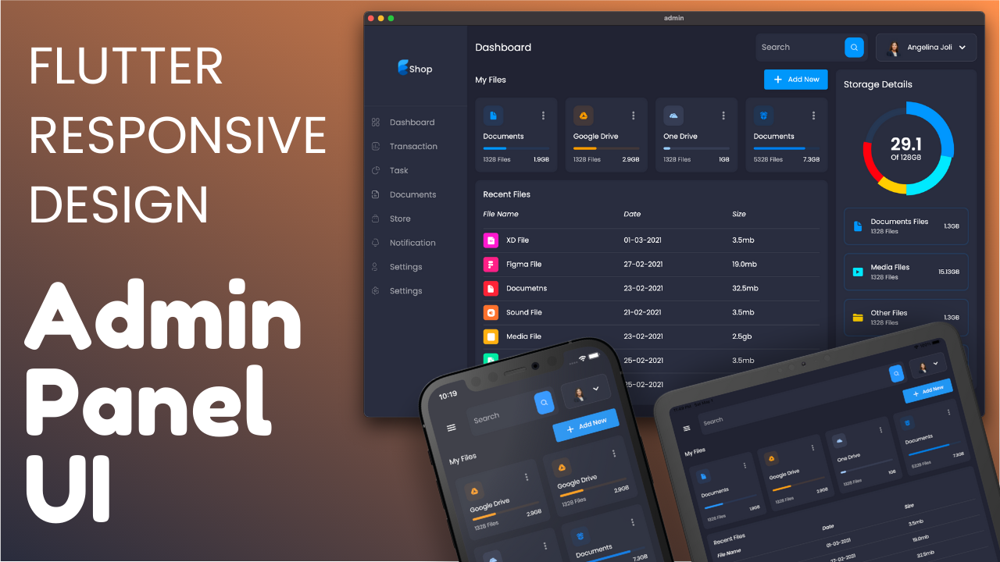

<h1 align="center">StockMind</h1>

<p align="center">
  
</p>

<p align="center">
  Sistema de gestión de inventario construido con <strong>Flutter + Firebase</strong>, diseñado con enfoque SaaS para ofrecer una experiencia moderna, responsive y profesional.
</p>

<p align="center">
  <a href="https://flutter.dev/">
    
  </a>
  <a href="https://dart.dev/">
    
  </a>
  <a href="https://firebase.google.com/">
    
  </a>
  <a href="https://pub.dev/packages/provider">
    
  </a>
  <a href="https://pub.dev/packages/go_router">
    
  </a>
</p>

<p align="center">
  
  
  
</p>

---

## Descripción

**StockMind** es una aplicación de gestión de inventario enfocada en negocios que necesitan controlar productos, monitorear stock, visualizar métricas operativas y responder rápidamente a alertas de reposición.

El proyecto fue diseñado como un dashboard moderno tipo SaaS, con una arquitectura organizada, autenticación integrada con Firebase y experiencia adaptativa para **web, tablet y móvil**.

## Vista General

- Gestión centralizada de productos e inventario.
- Dashboard con métricas y gráficos accionables.
- Alertas automáticas de bajo stock.
- Login con Firebase Auth y persistencia de sesión.
- Diseño limpio y profesional con modo claro/oscuro.
- Base sólida para evolucionar a producto real o de portafolio.

## Funcionalidades Principales

### Dashboard Administrativo

- Métricas clave del inventario.
- Indicadores de stock total y productos críticos.
- Visualización de datos con `fl_chart`.
- Resumen visual del estado operativo.

### Gestión de Productos

- Crear productos.
- Editar productos.
- Eliminar productos.
- Buscar por nombre, categoría o SKU.
- Filtrar por categoría y estado de stock.

### Alertas Inteligentes

- Detección automática de bajo stock.
- Vista dedicada para productos críticos.
- Preparado para futuras notificaciones o automatizaciones.

### Autenticación

- Inicio de sesión con email y contraseña.
- Registro de nuevos usuarios.
- Recuperación de contraseña.
- Google Sign-In.
- Sesión persistente mediante Firebase Auth.

### Experiencia de Usuario

- Diseño responsive.
- Sidebar en escritorio.
- Navegación adaptada en móvil.
- Modo claro y oscuro persistente.
- Transiciones suaves entre pantallas.

## Tecnologías Usadas

| Tecnología | Uso |
|---|---|
| Flutter | Desarrollo multiplataforma |
| Dart | Lenguaje principal |
| Firebase Core | Inicialización de Firebase |
| Firebase Auth | Autenticación |
| Cloud Firestore | Base de datos |
| Provider | Manejo de estado |
| GoRouter | Navegación declarativa |
| Google Fonts | Tipografía |
| FL Chart | Gráficos |
| Shared Preferences | Persistencia de preferencias |

## Estructura del Proyecto

```text
lib/
  core/
    router/
    theme/
  features/
    app/
    auth/
      presentation/
        screens/
        widgets/
    dashboard/
      presentation/
        screens/
        widgets/
    shell/
      presentation/
  models/
  providers/
  services/
    auth/
    products/
    stock/
test/
assets/
  screenshots/
```

## Capturas

Las siguientes imágenes son placeholders. Reemplázalas por capturas reales de la aplicación dentro de `assets/screenshots/`.

### Login


### Dashboard


### Productos



### Alertas


## Instalación Paso a Paso

### 1. Clonar el repositorio

```bash
git clone https://github.com/matiasConcha1/StockMind.git
cd StockMind
```

### 2. Instalar dependencias

```bash
flutter pub get
```

### 3. Configurar Firebase

Ejecuta el asistente oficial de FlutterFire:

```bash
flutterfire configure
```

Después, en Firebase Console habilita:

- `Authentication > Email/Password`
- `Authentication > Google`
- `Firestore Database`

Configuración recomendada adicional:

- Android: registra `SHA-1` y `SHA-256`.
- Web: agrega tu dominio a los dominios autorizados.

### 4. Ejecutar la app

```bash
flutter run -d chrome
```

También puedes ejecutarla en Android, iOS, Windows o macOS según tu entorno.

## Modelo de Datos Sugerido

```text
users/{uid}/products/{productId}
```

Campos principales por producto:

- `name`
- `category`
- `sku`
- `price`
- `stock`
- `minimumStock`
- `createdAt`
- `updatedAt`

## Estado del Proyecto

**Estado actual:** en desarrollo activo.

StockMind ya cuenta con:

- Base visual moderna tipo SaaS.
- Autenticación con Firebase.
- Dashboard responsive.
- CRUD de productos.
- Alertas de bajo stock.
- Soporte de tema claro y oscuro.

Próximas mejoras posibles:

- Movimientos de inventario.
- Exportación CSV/PDF.
- Roles y permisos.
- Historial de actividad.
- Reportes avanzados.

## Autor

**Matías Concha**

- GitHub: [matiasConcha1](https://github.com/matiasConcha1)
- Correo: [matiasconcha.2025@gmail.com](mailto:matiasconcha.2025@gmail.com)

## Contacto

Si quieres colaborar, reportar una mejora o usar este proyecto como base, puedes contactarme directamente desde GitHub o por correo.

---

<p align="center">
  Hecho con Flutter, Firebase y enfoque de producto real.
</p>
