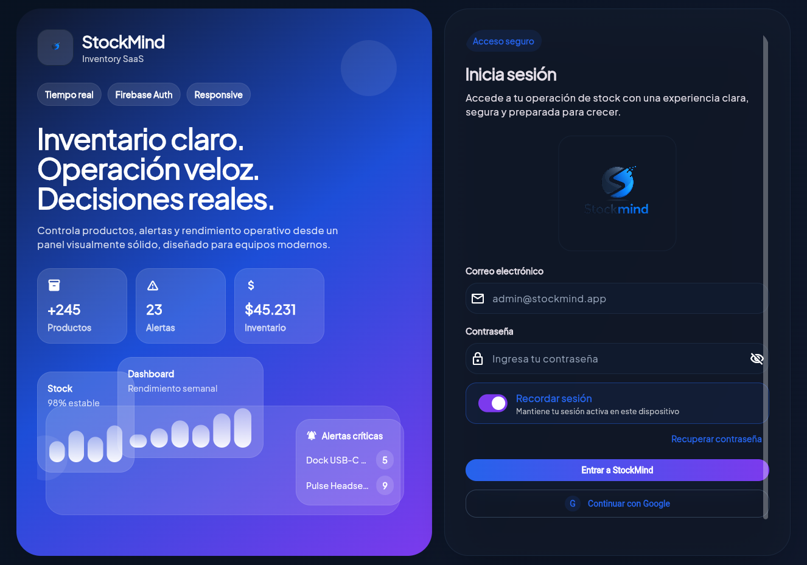
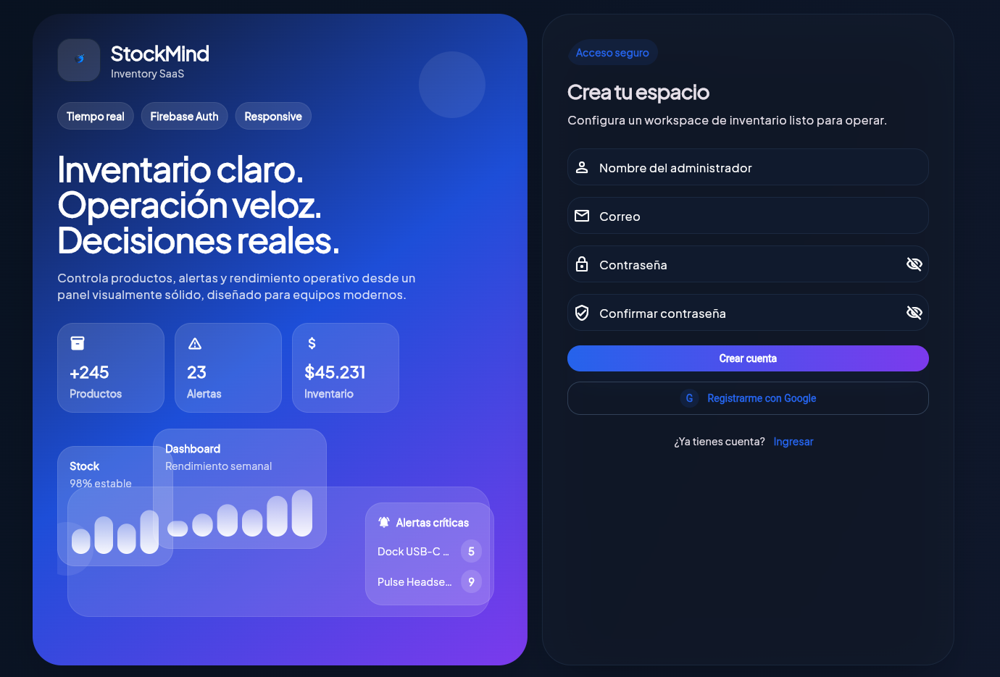
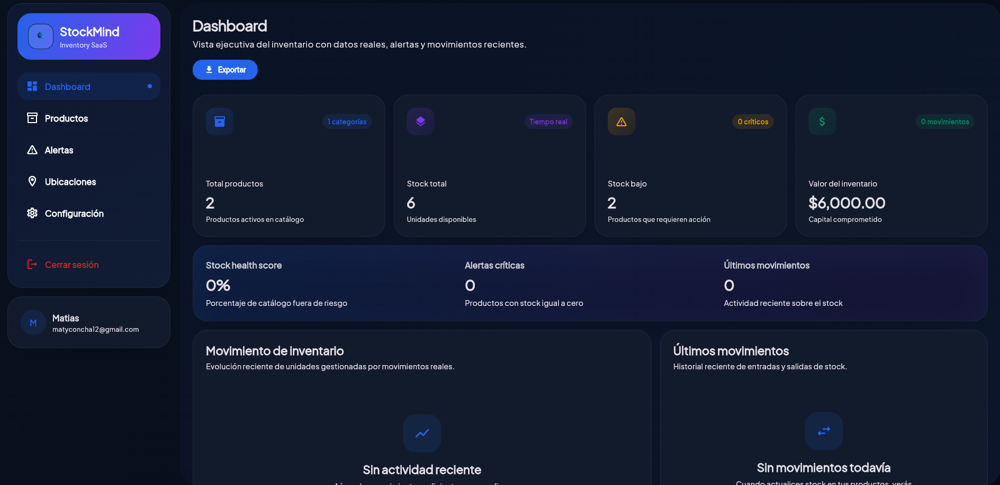
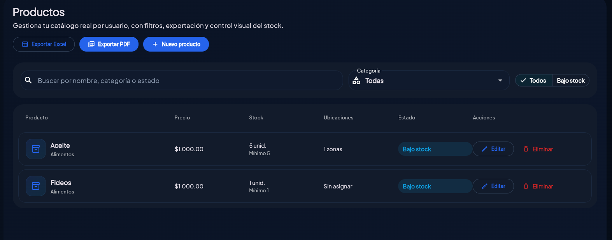
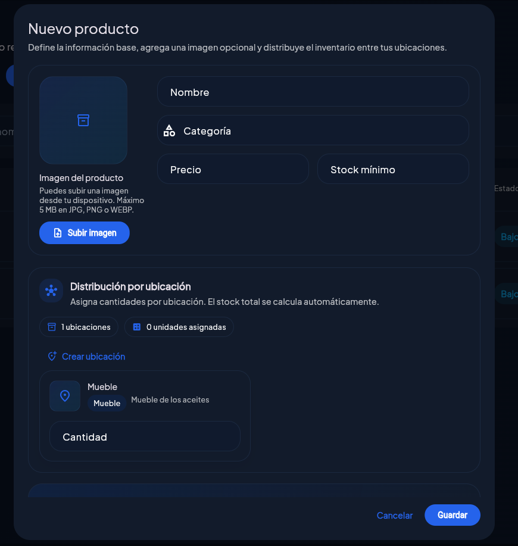
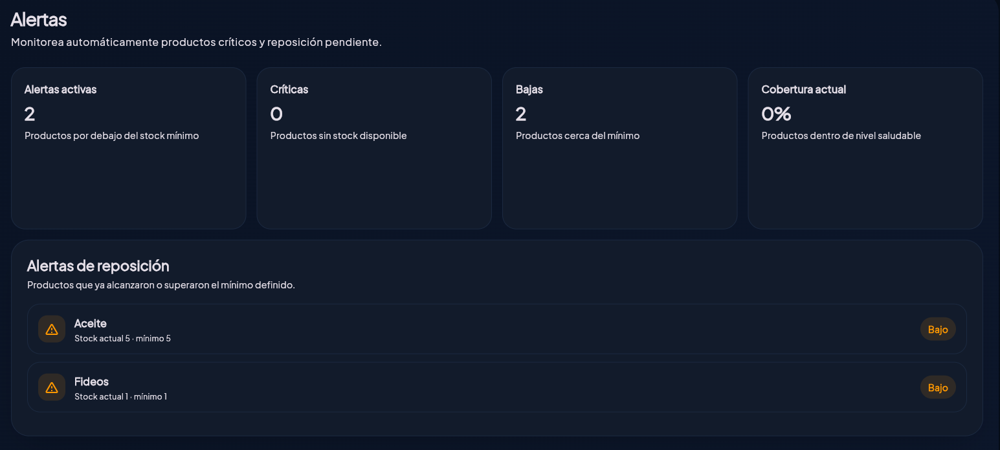
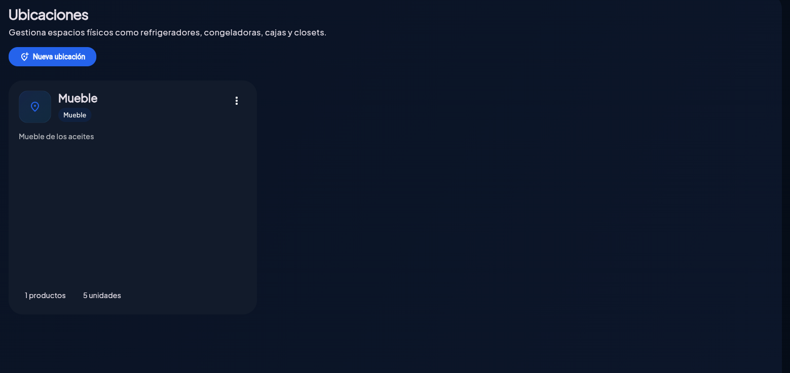
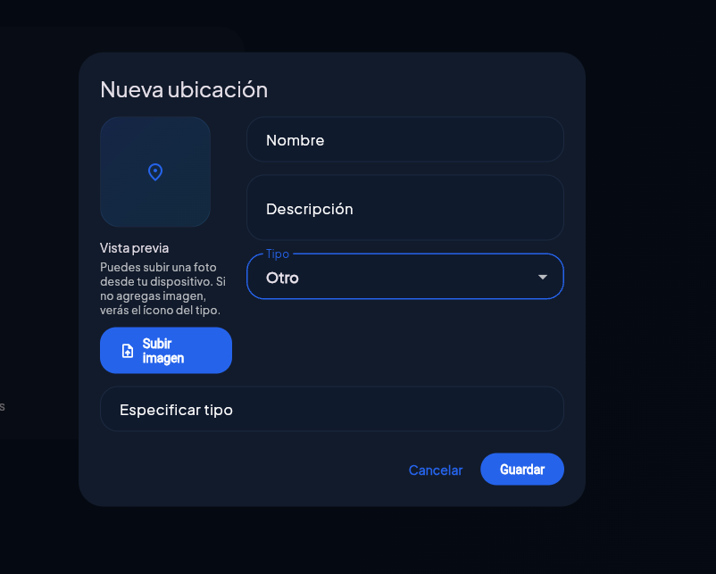
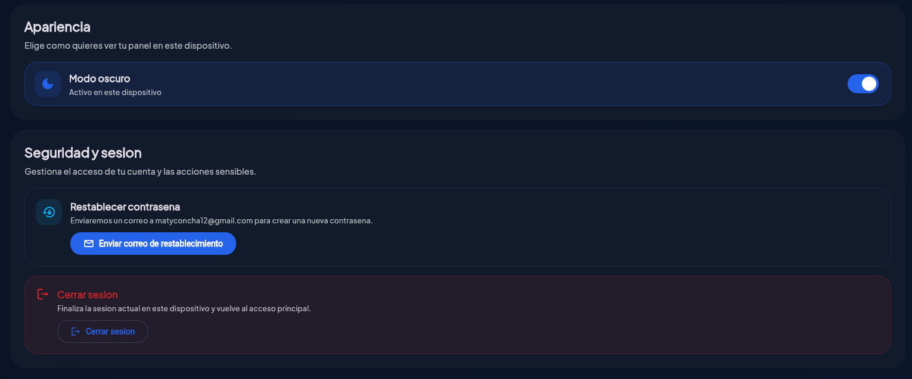
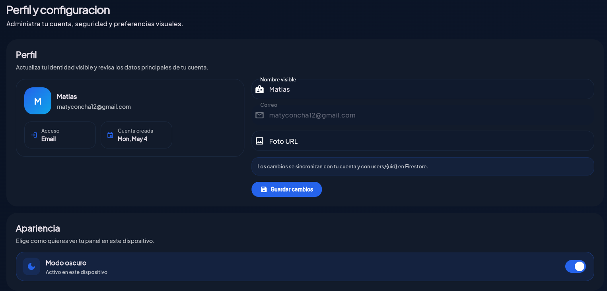

# StockMind

<p align="center">
  
</p>

<p align="center">
  Sistema moderno de gestión de inventario para negocios que necesitan controlar su stock de forma simple, rápida y visual.
</p>

<p align="center">
  <a href="https://ejemplofirebase-38f98.web.app">🌐 Ver demo en vivo</a>
</p>

---

## Descripción

**StockMind** es una plataforma tipo SaaS desarrollada con **Flutter Web + Firebase**, pensada para reemplazar planillas, cuadernos o sistemas complejos de inventario.

Permite gestionar productos, ubicaciones físicas, imágenes, alertas de stock bajo y métricas operativas en tiempo real desde una interfaz moderna y responsive.

---

## Características principales

- Autenticación con Email y Google
- Gestión completa de productos
- Control de ubicaciones físicas
- Subida de imágenes para productos y ubicaciones
- Alertas automáticas de stock bajo
- Dashboard con métricas en tiempo real
- Exportación a Excel y PDF
- Modo oscuro / claro
- PWA instalable
- Deploy en Firebase Hosting

---

## Capturas de pantalla

### Login


---

### Registro


---

### Dashboard


---

### Productos


---

### Nuevo producto


---

### Alertas


---

### Ubicaciones


---

### Nueva ubicación


---

### Configuración


---

### Perfil y seguridad


---

## Tecnologías utilizadas

| Tecnología | Uso |
|---|---|
| Flutter Web | Frontend multiplataforma |
| Dart | Lenguaje principal |
| Firebase Auth | Autenticación |
| Cloud Firestore | Base de datos en tiempo real |
| Firebase Storage | Almacenamiento de imágenes |
| Firebase Hosting | Deploy web |
| Provider | Gestión de estado |
| GoRouter | Navegación |
| Google Fonts | Tipografía |
| Material Icons | Iconografía |

---

## Estructura del proyecto

```bash
lib/
├── app/
├── core/
├── features/
│   ├── auth/
│   ├── dashboard/
│   ├── products/
│   ├── locations/
│   ├── alerts/
│   └── settings/
├── services/
├── firebase_options.dart
└── main.dart

## Instalación local

```bash
git clone https://github.com/matiasConcha1/StockMind.git
cd StockMind
flutter pub get
flutter run -d chrome
Configuración Firebase

Para ejecutar el proyecto con Firebase real:

Crear un proyecto en Firebase
Activar Authentication:
Email/Password
Google
Crear Cloud Firestore
Activar Firebase Storage

Luego ejecutar:

flutterfire configure
Build y deploy
flutter build web --release
firebase deploy
Demo

🌐 https://ejemplofirebase-38f98.web.app

Roadmap
Multiempresa
Roles de usuario
Historial avanzado de movimientos
Notificaciones push
Suscripciones
Reportes avanzados
Autor

Matías Concha
Ingeniero en Informática

GitHub: https://github.com/matiasConcha1
Email: matyconcha12@gmail.com
Licencia

Proyecto desarrollado con fines profesionales y de portafolio.
Para colaboración o uso comercial, contactar al autor.

Estado
✅ MVP funcional
✅ Firebase integrado
✅ Deploy web activo
✅ PWA instalable
🔥 Nivel SaaS / Portafolio profesional
